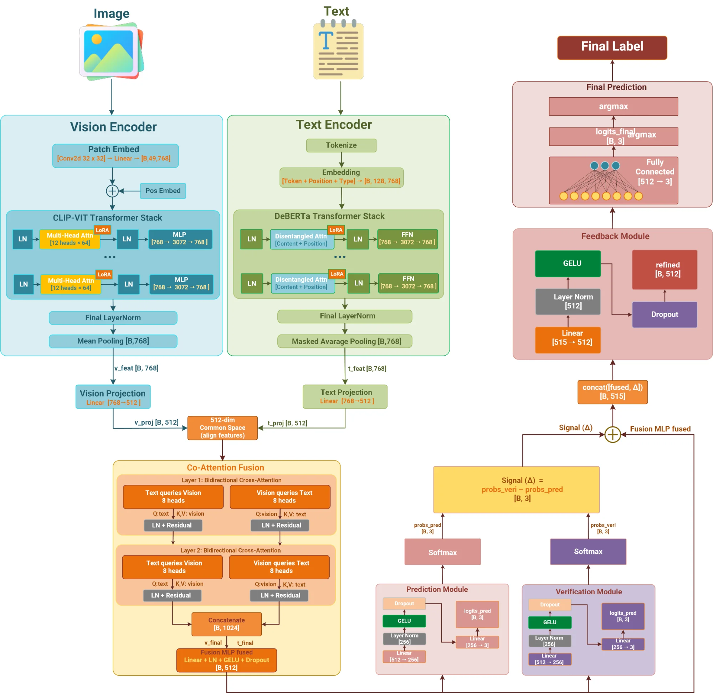

# CLARA: Enhancing Multimodal Sentiment Analysis via Efficient Vision-Language Fusion

[](https://doi.org/10.5281/zenodo.17862924)
[](https://doi.org/10.5281/zenodo.17889083)
[](https://opensource.org/licenses/MIT)
[](https://www.python.org/downloads/)
[](https://pytorch.org/)

---

## ⚠️ IMPORTANT NOTICE

**This code is directly related to our manuscript currently under review at The Visual Computer (Springer).**

**If you use this code in your research, please cite our paper:**

```bibtex
@article{lam2025clara,
  title={CLARA: Enhancing Multimodal Sentiment Analysis via Efficient Vision-Language Fusion},
  author={Lam, Phuong and Phan, Tuoi Thi and Tran, Thien Khai},
  journal={The Visual Computer},
  year={2025},
  publisher={Springer},
  note={Under Review},
  doi={10.5281/zenodo.17889083}
}
```

**Paper Status:**
- **Journal:** The Visual Computer (Springer)
- **Status:** Under Review
- **Submitted:** December 2025

---

## 📋 Table of Contents

- [Overview](#overview)
- [Architecture](#architecture)
- [Key Features](#key-features)
- [Performance](#performance)
- [Installation](#installation)
- [Datasets](#datasets)
- [Pre-trained Models](#pre-trained-models)
- [Results](#results)
- [Citation](#citation)
- [Contact](#contact)

---

## 🎯 Overview

**CLARA** (Co-attention Learning for Robust multimodal sentiment Analysis) is a parameter-efficient vision-language framework for multimodal sentiment analysis on social media image-text pairs.

### Why CLARA?

CLARA achieves **state-of-the-art performance** while updating only **7.45% of parameters**:

- ✅ **83.16% accuracy** on MVSA-Single (+3.83% over previous SOTA)
- ✅ **73.51% accuracy** on MVSA-Multiple (+0.22% over previous SOTA)
- ✅ **88.13% accuracy** on HFM hate speech detection (+1.03% over previous SOTA)
- ✅ **51.9% faster training** compared to full fine-tuning
- ✅ **62.5% lower memory usage** (6GB vs 16GB peak GPU memory)

---

## 🏗️ Architecture

CLARA integrates six key components for efficient and effective multimodal sentiment analysis:



### Components:

1. **Vision Encoder**: CLIP ViT-B/16 with LoRA adapters (r=8, α=16)
2. **Text Encoder**: DeBERTa-base with hybrid LoRA + selective unfreezing
3. **Projection Layers**: Map both modalities to shared 512-dimensional space
4. **Co-Attention Fusion**: Two-layer bidirectional multi-head attention (8 heads)
5. **Verification Module**: Computes modality consensus from unimodal predictions
6. **Feedback Module**: Refines final prediction using disagreement signal

### Key Innovation:

Unlike traditional fusion approaches, CLARA's **bidirectional co-attention** creates explicit associations between visual regions and textual spans through symmetric vision↔text and text↔vision processing paths.

---

## ✨ Key Features

### 1. Parameter Efficiency
- **Only 7.45% trainable parameters** (21.27M / 285.47M total)
- **LoRA rank r=8** applied to attention projections
- **92.2% parameter reduction** vs full fine-tuning

### 2. Cross-Modal Reasoning
- **Bidirectional co-attention** prevents text bias
- **8 attention heads** for diverse alignment patterns
- **Explicit image-phrase associations**

### 3. Consensus Modeling
- **Verification module** computes agreement signal
- **Feedback mechanism** integrates consensus
- **Enhanced neutral class** prediction (+8.34% F1)

### 4. Robust Performance
- **State-of-the-art** on 3 diverse benchmarks
- **Strong generalization** across sentiment classes
- **Well-calibrated predictions**

---

## 📊 Performance

### Main Results

| Dataset | Metric | CLARA | Previous SOTA | Improvement |
|---------|--------|-------|---------------|-------------|
| **MVSA-Single** | Accuracy | **83.16%** | 79.33% | +3.83% |
| | Weighted F1 | **83.04%** | 77.51% | +5.53% |
| **MVSA-Multiple** | Accuracy | **73.51%** | 73.29% | +0.22% |
| | Weighted F1 | **73.45%** | 70.06% | +3.39% |
| **HFM** | Accuracy | **88.13%** | 87.10% | +1.03% |
| | Macro F1 | **87.82%** | 86.62% | +1.20% |

### Efficiency Comparison

| Method | Trainable | Train Time | Memory | F1 Score |
|--------|-----------|------------|--------|----------|
| Full Fine-tuning | 272.0M (100%) | 1.35h | 16GB | 76.50% |
| **CLARA (LoRA)** | **21.27M (7.45%)** | **0.65h** | **6GB** | **83.04%** |
| **Improvement** | **-92.2%** | **-51.9%** | **-62.5%** | **+6.54%** |

---

## 🚀 Installation

### Requirements

- Python 3.8+
- PyTorch 2.0+
- CUDA 11.8+ (for GPU support)
- 8GB+ GPU memory

### Quick Install

```bash
# Clone repository
git clone https://github.com/phuonglamgithub/CLARA.git
cd CLARA

# Install dependencies
pip install -r requirements.txt
```

### Detailed Installation

#### Method 1: Conda (Recommended)

```bash
# Create conda environment
conda create -n clara python=3.8
conda activate clara

# Install PyTorch with CUDA
conda install pytorch torchvision torchaudio pytorch-cuda=11.8 -c pytorch -c nvidia

# Install other dependencies
pip install transformers==4.30.0 peft==0.4.0
pip install pillow numpy pandas matplotlib seaborn scikit-learn tqdm
```

#### Method 2: pip + virtualenv

```bash
# Create virtual environment
python -m venv clara_env
source clara_env/bin/activate  # Windows: clara_env\Scripts\activate

# Install dependencies
pip install -r requirements.txt
```

---

## 📊 Datasets

### Download Datasets

All datasets are available on Google Drive:

🔗 **[Download Link: CLARA Datasets](https://drive.google.com/drive/folders/15Dcqsm1OvJbU9_Ok1ylbK_widCekjK0O)**

**Contents:**
- `data/MVSA-Single/` - MVSA-Single dataset
- `data/MVSA-Multiple/` - MVSA-Multiple dataset  
- `data/HFM/` - Hateful Memes dataset

### Dataset Structure

After downloading, organize datasets as follows:

```
data/
│
├── MVSA-Single/                      
│   ├── images/                       
│   │   ├── 1.jpg
│   │   ├── 2.jpg
│   │   └── ...
│   └── labelResultAll.txt            
│
├── MVSA-Multiple/                    
│   ├── images/                       
│   │   ├── 1.jpg
│   │   ├── 2.jpg
│   │   └── ...
│   └── labelResultAll.txt            
│
└── HFM/                              
    ├── image/                        
    ├── train/                        
    ├── val/                          
    ├── test/                         
    └── text/
        ├── train.txt                
        ├── val.txt
        └── test.txt
```


### Dataset Statistics

#### MVSA-Single
- **Total:** 2,592 samples (after cleaning)
- **Classes:** Positive (1,398), Neutral (470), Negative (724)
- **Train/Val/Test:** 1,813 / 387 / 392

#### MVSA-Multiple
- **Total:** 3,555 samples (after filtering)
- **Classes:** Positive (2,173), Neutral (1,268), Negative (114)
- **Train/Val/Test:** 2,487 / 532 / 536
- **Challenge:** Extremely imbalanced (3.2% negative)

#### HFM (Hateful Memes)
- **Total:** 24,635 samples
- **Classes:** Hateful (13,988), Non-hateful (10,647)
- **Train/Val/Test:** 19,816 / 2,410 / 2,409

---

## 🎯 Pre-trained Models

### Download Model Checkpoints

Pre-trained CLARA models are available on Google Drive in the `checkpoints/` folder:

🔗 **[Download Link: Model Checkpoints](https://drive.google.com/drive/folders/15Dcqsm1OvJbU9_Ok1ylbK_widCekjK0O)**

**Available Models:**
- `checkpoints/clara_mvsa_single.pt` - Trained on MVSA-Single
- `checkpoints/clara_mvsa_multi.pt` - Trained on MVSA-Multiple
- `checkpoints/clara_hfm.pt` - Trained on HFM

### Checkpoint Structure

```
CLARA/
├── checkpoints/
│   ├── clara_mvsa_single.pt
│   ├── clara_mvsa_multi.pt
│   └── clara_hfm.pt
```

### Model Specifications

| Model | Dataset | Size | Accuracy | F1 Score |
|-------|---------|------|----------|----------|
| `clara_mvsa_single.pt` | MVSA-Single | ~85 MB | 83.16% | 83.04% |
| `clara_mvsa_multi.pt` | MVSA-Multiple | ~85 MB | 73.51% | 73.45% |
| `clara_hfm.pt` | HFM | ~85 MB | 88.13% | 87.82% |

---

## 📸 Results

### Confusion Matrices and performance

All confusion matrices and performance visualizations are available in the `results/` folder:

🔗 **[Download Link: Results Images](https://drive.google.com/drive/folders/15Dcqsm1OvJbU9_Ok1ylbK_widCekjK0O)**

**Available Visualizations:**
- `results/confusion_matrix_mvsa_single.png`
- `results/confusion_matrix_mvsa_multiple.png`
- `results/confusion_matrix_hfm.png`
- `results/attention_visualization_samples.png`
- `results/performance_comparison.png`

### Results Structure

```
CLARA/
└──results/
   ├── confusion_matrix_mvsa_single.png
   ├── confusion_matrix_mvsa_multiple.png
   ├── confusion_matrix_hfm.png
   ├── attention_visualization_samples.png
   ├── performance_comparison.png
   └── per_class_performance.png
```

## 📖 Citation

If you use this code or models in your research, please cite:

### Paper Citation
```bibtex
@article{lam2025clara,
  title={CLARA: Enhancing Multimodal Sentiment Analysis via Efficient Vision-Language Fusion},
  author={Lam, Phuong and Phan, Tuoi Thi and Tran, Thien Khai},
  journal={The Visual Computer},
  year={2025},
  publisher={Springer},
  note={Under Review},
  doi={10.5281/zenodo.17862924}
}
```

### Code Citation
```bibtex
@software{lam2025clara_code,
  title={CLARA: Implementation},
  author={Lam, Phuong and Phan, Tuoi Thi and Tran, Thien Khai},
  year={2025},
  publisher={Zenodo},
  version={v1.1.0},
  doi={10.5281/zenodo.17889083},
  url={https://github.com/phuonglamgithub/CLARA}
}
```

---

## 📞 Contact

### Authors

- **Phuong Lam**
  - Email: lamphuong.ict89@gmail.com
  - Affiliation: HUFLIT, Vietnam

- **Tuoi Thi Phan**
  - Email: pttuoi@ntt.edu.vn
  - Affiliation: Nguyen Tat Thanh University, Vietnam

- **Thien Khai Tran** (Corresponding Author)
  - Email: thientk@huit.edu.vn
  - Affiliation: HUIT, Vietnam

### Support

**For questions about the code or paper:**

- **Primary Contact:** thientk@huit.edu.vn (Thien Khai Tran)
- **Secondary Contact:** lamphuong.ict89@gmail.com (Phuong Lam)
- **GitHub Issues:** https://github.com/phuonglamgithub/CLARA/issues

---

## 📄 License

This project is licensed under the MIT License - see the [LICENSE](LICENSE) file for details.

---

## 🔗 Links & Resources

### Repository & Archives

- **GitHub Repository:** https://github.com/phuonglamgithub/CLARA
- **Zenodo (All Versions):** https://doi.org/10.5281/zenodo.17862924 *(Concept DOI - always points to latest)*
- **Zenodo (v1.1.0 Specific):** https://doi.org/10.5281/zenodo.17889083 *(Version DOI - permanent link)*
- **Zenodo (v1.0.0 Specific):** https://doi.org/10.5281/zenodo.17862925 *(Initial release)*

### External Resources

- **Model Checkpoints:** [Google Drive](https://drive.google.com/drive/folders/15Dcqsm1OvJbU9_Ok1ylbK_widCekjK0O) (~255 MB)
- **Datasets:** [Google Drive](https://drive.google.com/drive/folders/15Dcqsm1OvJbU9_Ok1ylbK_widCekjK0O) (~5.5 GB)
- **Paper:** Under review at The Visual Computer (Springer)

### Documentation

- **Setup Guide:** [SETUP_GUIDE.md](SETUP_GUIDE.md)
- **Complete Guide:** [COMPLETE_GUIDE.md](COMPLETE_GUIDE.md)
- **API Documentation:** [docs/README.md](docs/README.md)
- **Data Formats:** [data/README.md](data/README.md)
- **Model Details:** [checkpoints/README.md](checkpoints/README.md)
- **Notebook Guide:** [notebooks/README.md](notebooks/README.md)

---

<div align="center">

**Made with ❤️ by the CLARA Team**

**Parameter-Efficient • State-of-the-Art • Open Source**

</div>
